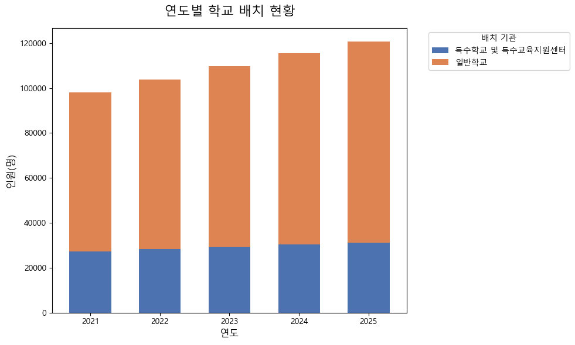
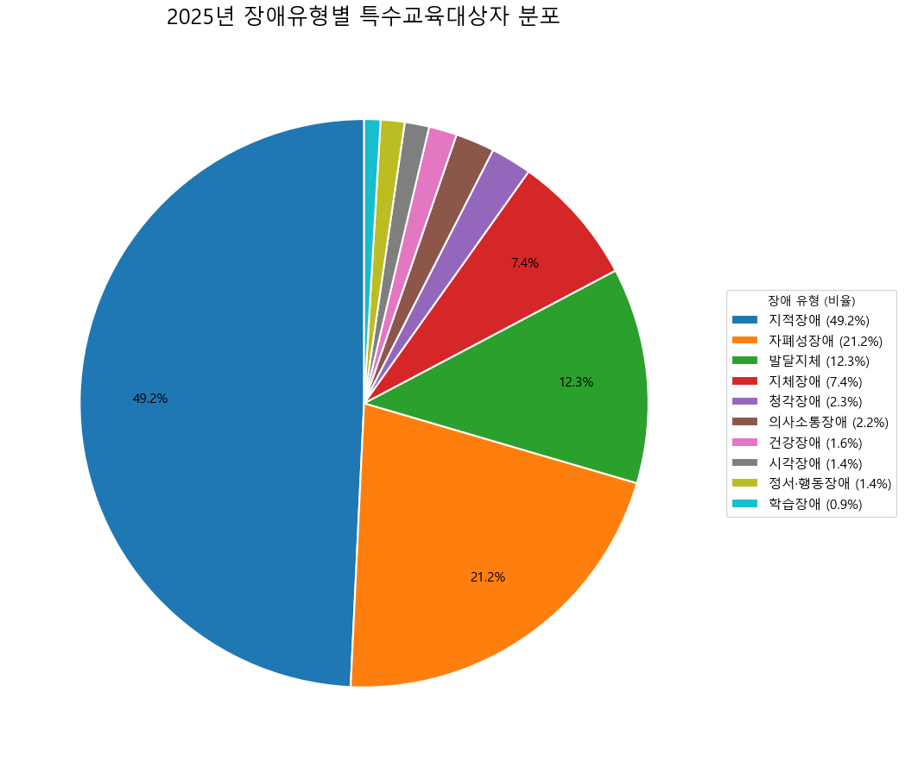
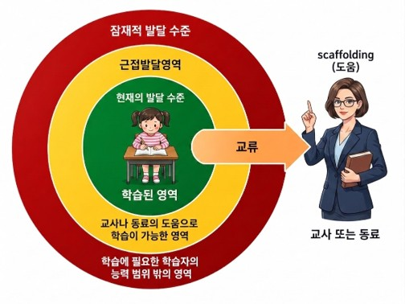
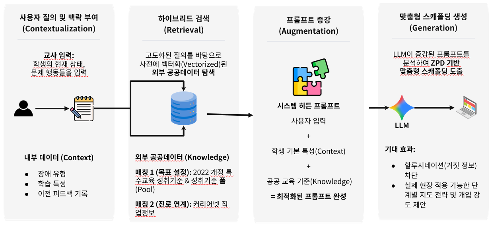
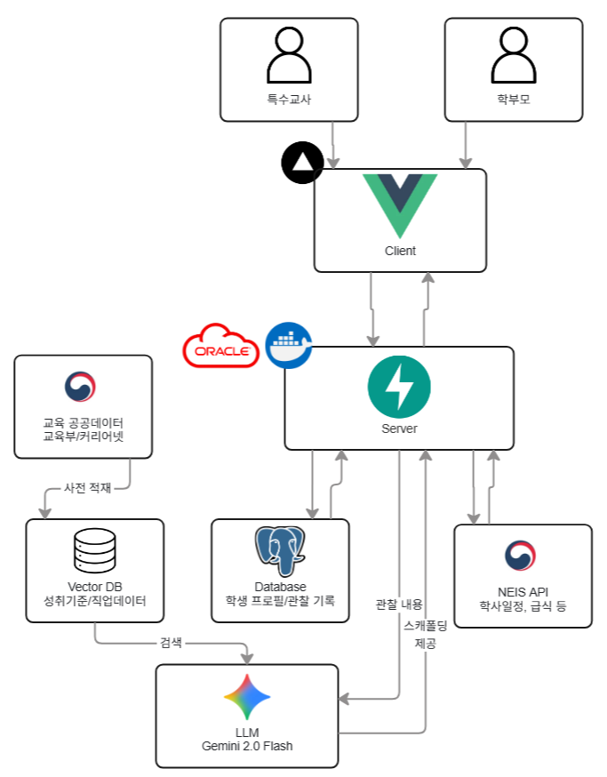
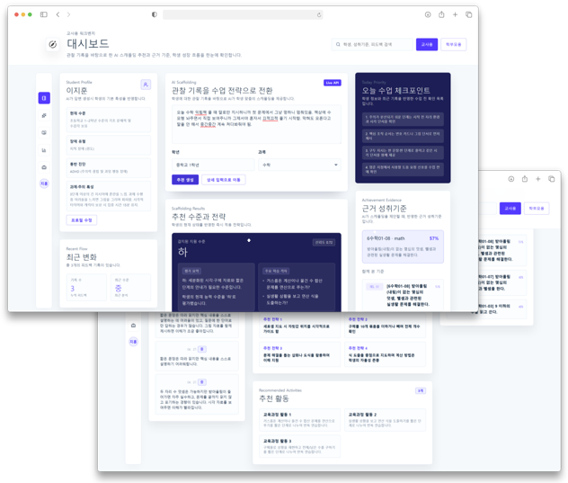
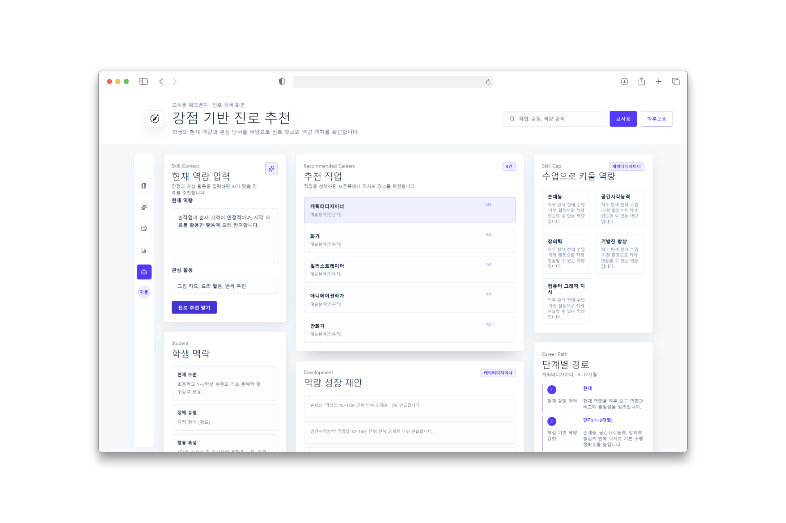
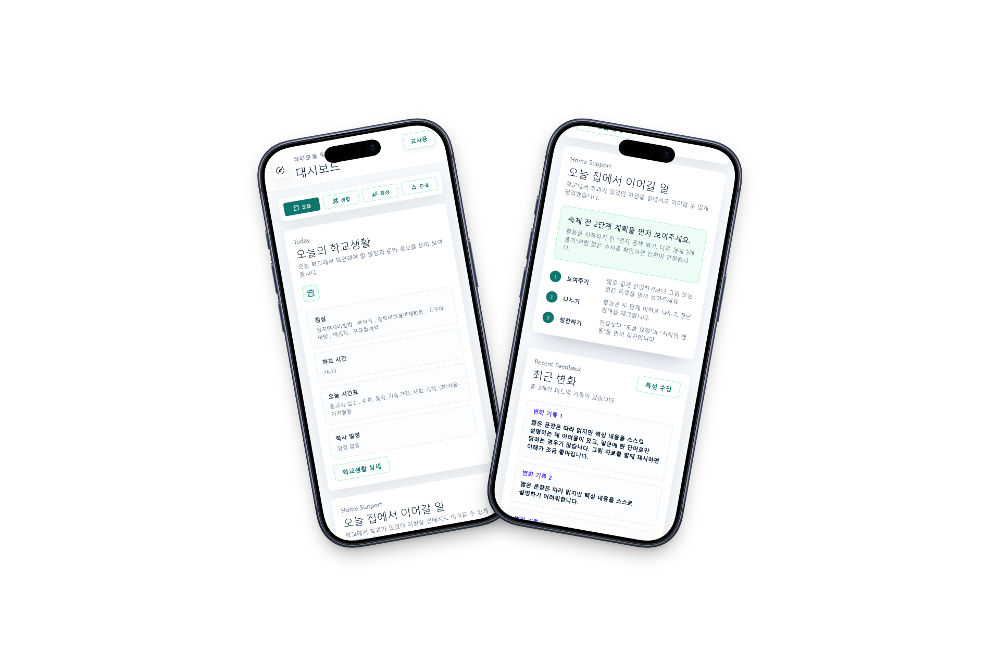

# 틔움(Tium)
**RAG 아키텍처와 공공데이터를 활용한 지능형 특수교육 스캐폴딩 플랫폼**

<p align="center">
  
</p>

<br>

## 목차

- [1. 프로젝트 소개](#1-프로젝트-소개)
- [2. 개발팀](#2-개발팀)
- [3. 배경 및 문제 제기](#3-배경-및-문제-제기)
- [4. 해결 방안](#4-해결-방안)
  - [이론적 배경: 근접발달영역(ZPD)](#이론적-배경-근접발달영역zpd)
  - [기술적 배경: RAG 아키텍처](#기술적-배경-rag-아키텍처)
- [5. 기술 스택 및 구조](#5-기술-스택-및-구조)
  - [기술 스택(Tech Stack)](#기술-스택tech-stack)
  - [프로젝트 폴더 구조(Directory Structure)](#프로젝트-폴더-구조directory-structure)
- [6. 핵심 기능 소개 및 데모](#6-핵심-기능-소개-및-데모)
- [7. 사용 데이터 및 설명](#7-사용-데이터-및-설명)
- [8. 라이선스 및 이용 제한 안내](#8-라이선스-및-이용-제한-안내)

<br>

## 1. 프로젝트 소개

> **틔움(Tium)** 은 공신력 있는 공공데이터 지식 베이스와 대규모 검색 증강 생성(RAG) 아키텍처를 결합하여, 특수학생의 인지적·행동적 특성을 정밀 분석하고 ZPD 이론에 기반한 단계별 맞춤형 지도 전략(Scaffolding)을 제안하는 지능형 IEP 지원 서비스. 커리어넷 직업정보와 연계한 진로 로드맵 설계 기능까지 더해, 교사의 부담을 줄이고 학부모와 학교가 일관된 방향으로 소통할 수 있도록 지원.

<br>

## 2. 개발팀

- **개발기간**: 2026.04.19 ~ 2026.05.31
- **출품 내역**: 제 8회 교육공공데이터 AI활용대회 (아이디어 기획 일반부) 출품

<table>
  <tbody>
    <tr>
      <td align="center">
        <a href="https://github.com/g-yunjh">
          
          <br />
          <sub><b>윤주환</b></sub>
        </a>
        <br />
        <a href="https://github.com/g-yunjh">@g-yunjh</a>
      </td>
      <td align="center">
        <a href="https://github.com/s0ma02">
          
          <br />
          <sub><b>김재혁</b></sub>
        </a>
        <br />
        <a href="https://github.com/s0ma02">@s0ma02</a>
      </td>
    </tr>
  </tbody>
</table>

<br>

## 3. 배경 및 문제 제기

### 매년 늘어나는 특수교육대상자

- 특수교육대상자는 매년 꾸준히 증가하여 **2025년 기준 120,735명** 기록
- 일반학교(통합학급) 배치 비율이 압도적으로 높아, 일반 교사와 특수 교사 모두의 실무적 부담 급증

<p align="center">
  
</p>

### 다양한 장애 특성과 맞춤형 교육의 필요성

- 2025년 기준 장애유형별 분포는 **지적장애 49.2%, 자폐성장애 21.2%** 등으로 다양화
- 동일한 장애 유형이라도 학생마다 특성이 달라 적합한 교육 방법 또한 상이
- 이로 인해 교사가 학생 개개인의 특성을 이해하고 맞춤형 교육을 운영하는 데 어려움 발생

<p align="center">
  
</p>

### 현장의 주요 문제점

- 학생마다 특성과 지원 필요 수준이 달라, 적절한 지도 방향과 개입 수준 판단의 어려움 존재
- 중복 장애를 포함한 다양한 장애 특성에 맞는 맞춤형 지도 자료와 사례 부족
- 학교와 가정 간 정보 공유와 지도 연계가 원활하지 않아 지속적인 지원에 한계 발생
- 새로운 학급·교사·학생 환경에 적응하는 데 많은 시간 소요

<br>

## 4. 해결 방안

### 이론적 배경: 근접발달영역(ZPD)

**Zone of Proximal Development**

<p align="center">
  
</p>

- 학습자가 혼자 해결할 수 있는 수준과, 타인의 도움을 받아 해결할 수 있는 수준 사이의 영역
- 학생은 적절한 도움과 상호작용을 통해 더 높은 수준의 학습에 도달 가능
- 교사, 보호자, 또래의 지원은 학습 과정에서 핵심적인 역할 수행
- 학습자의 현재 수준에 맞춘 단계적 지원(Scaffolding)이 효과적인 학습으로 연결

### 기술적 배경: RAG 아키텍처

**Retrieval-Augmented Generation**

<p align="center">
  
</p>

- 생성형 AI가 답변을 생성하기 전, 외부 데이터를 먼저 검색(Retrieval)한 뒤 이를 기반으로 답변을 생성(Generation)하는 구조
- 특수교육 성취기준, 성취기준 풀, 커리어넷 정보 등 공신력 있는 데이터를 기반으로 분석
- 검색된 데이터를 바탕으로 학생 수준에 적합한 맞춤형 비계(Scaffolding)와 지도 방향 제안
- 단순 생성형 AI 대비 정확하고 신뢰도 높은 결과를 제공하며, 최신 도메인 지식 반영
- 생성형 AI의 고질적 문제인 할루시네이션(Hallucination) 감소 효과

<br>

## 5. 기술 스택 및 구조

### 기술 스택(Tech Stack)

<p align="center">
  
</p>

#### Frontend

| Stack | Rationale |
| :--- | :--- |
|  | Composition API를 활용해 복잡한 대시보드(교사용/학부모용)의 비즈니스 로직(Custom Composables)을 모듈화하고 코드 재사용성을 극대화하기 위해 선택 |
|  | HMR(Hot Module Replacement) 속도가 빨라 UI 컴포넌트 개발 및 피드백 루프 단축에 압도적인 생산성을 제공하여 도입 |
|  | 별도의 CSS 파일 분리 없이 유틸리티 클래스 기반으로 빠르게 일관된 UI 시스템을 구축하고, 반응형 대시보드를 효율적으로 구현하기 위해 사용 |

#### Backend

| Stack | Rationale |
| :--- | :--- |
|  | 비동기(Async/Await) 처리를 기본 지원하여 AI 모델 API 호출 시 병목을 줄이고, Pydantic 기반의 자동 데이터 검증 및 Swagger 문서 자동화로 협업 효율 제고 |
|  | 공공데이터 가공, 텍스트 청킹 스크립트 작성 및 LangChain/Gemini 등 AI 인프라 생태계 라이브러리와의 유연한 결합을 위해 메인 언어로 채택 |

#### Database & AI Pipeline

| Stack | Rationale |
| :--- | :--- |
|  | 학생 프로필, 행동 특성 등 구조화된 관계형 데이터를 무결성 있게 관리하고, 향후 확장성(pgvector 등)을 고려하여 선택 |
|  | 임베딩된 특수교육과정 지식 베이스를 로컬 환경에서 가볍고 빠르게 인덱싱하고, 시맨틱 검색(Semantic Search)을 통해 정확한 컨텍스트를 LLM에 주입하기 위해 사용 |
|  | 대용량 컨텍스트 윈도우와 뛰어난 비용 효율성(`gemini-2.5-flash`), 고성능 임베딩 기능(`text-embedding-004`)을 동시에 활용하기 위해 선택 |
|  | 다양한 데이터 로더(JSON, CSV) 및 프롬프트 템플릿 관리, RAG 체인 구축을 추상화하여 AI 비즈니스 로직의 결합도를 낮추기 위해 도입 |

#### DevOps & Infrastructure

| Stack | Rationale |
| :--- | :--- |
|  | 상시 무료 VM 레이어를 활용하여 인프라 비용 부담 없이 Docker 컨테이너 기반의 백엔드 및 데이터베이스 레이어를 안정적으로 독립 호스팅하기 위해 사용 |
|  | Vue.js 프론트엔드의 빌드 및 배포 파이프라인(CI/CD)을 자동화하고, 전 세계 엣지 네트워크를 통한 빠른 대시보드 로딩 성능을 확보하기 위해 선택 |
|  | 개발 환경(로컬)과 배포 환경(OCI VM) 간의 환경 차이로 인한 이슈를 제거하고, 복잡한 데이터베이스(PostgreSQL, ChromaDB)를 Docker Compose로 단일 컨테이너화하여 관리하기 위해 도입 |


### 프로젝트 폴더 구조(Directory Structure)

```text
📦 tium
 ┣ 📂 client               # Vue.js 프론트엔드
 ┃ ┣ 📂 public             # 정적 에셋 (파비콘, 공통 아이콘 등)
 ┃ ┗ 📂 src                # 애플리케이션 소스 코드
 ┃ ┃ ┣ 📂 api              # 백엔드 API 연동 정의
 ┃ ┃ ┣ 📂 components       # 대시보드 공통 UI 컴포넌트
 ┃ ┃ ┣ 📂 composables      # 상태 관리 및 맞춤형 비즈니스 로직 (Custom Composables)
 ┃ ┃ ┣ 📂 router          # Vue Router 라우팅 설정
 ┃ ┃ ┗ 📂 views           # 교사용 / 학부모용 대시보드 및 세부 서브 페이지
 ┗ 📂 server               # FastAPI 백엔드 & AI 파이프라인
   ┣ 📂 app                # 백엔드 핵심 애플리케이션 로직
   ┃ ┣ 📂 api              # RAG 체인 및 학생 프로필 관리 API 엔드포인트
   ┃ ┣ 📂 core             # 시스템 환경 변수 및 보안 설정
   ┃ ┣ 📂 db               # 데이터베이스 연결 및 SQLAlchemy ORM 모델
   ┃ ┣ 📂 schemas          # Pydantic 기반 데이터 검증 및 직렬화 스키마
   ┃ ┗ 📂 services         # RAG 오케스트레이터, LLM(Gemini) 연동, 나이스(NEIS) API 등 핵심 서비스 레이어
   ┣ 📂 data               # RAG 지식 베이스(Knowledge Base) 구축용 임베딩 대상 공공데이터
   ┃ ┣ 📂 careers          # 커리어넷 제공 직업 정보 데이터셋 (JSON)
   ┃ ┗ 📂 curriculum       # 2022 개정 특수교육과정 성취기준 및 풀(Pool) 데이터셋 (JSON)
   ┣ 📜 Dockerfile         # 백엔드 애플리케이션 도커 빌드 프로파일
   ┗ 📜 docker-compose.yml # 로컬 개발 환경용 데이터베이스(PostgreSQL, ChromaDB) 컨테이너 설정
```

<br>

## 6. 핵심 기능 소개 및 데모

### 핵심 기능 1 — AI 맞춤형 스캐폴딩

학생의 수업 참여도, 이해 수준, 행동 특성을 기록하면 AI가 ZPD 기반 맞춤형 스캐폴딩을 제안.

- 학생 수준에 적합한 교육 활동 및 학습 과제 추천
- 교사의 개입 강도와 지도 방향 구체적 제안
- 특수교육 성취기준 및 풀(Pool) 기반 학습 목표 자동 매칭
- 학생 특성과 장애 유형을 고려한 맞춤형 지원 전략 제공

<p align="center">
  
</p>

### 핵심 기능 2 — 학생 성장 분석 및 진로 로드맵

학습 기록과 스캐폴딩 데이터를 분석하여 강점을 발견하고, 적합한 진로 방향과 성장 로드맵을 설계.

- 학습 패턴 및 행동 특성 기반 강점/관심 영역 분석
- 발견된 강점과 연관된 직업 및 맞춤 활동 추천
- 학생 수준에 맞춘 단계별 역량 성장 방향 명확화
- 커리어넷 데이터를 활용한 현실적인 진로 탐색 지원
- 장기적인 성장 과정을 한눈에 보는 시각적 로드맵 제공

<p align="center">
  
</p>

### 그 외 기능

**나이스(NEIS) 연동**
- API 기반 시간표, 학사일정, 급식 메뉴 등 자동 연동
- 학생 및 학부모가 일상적인 학교생활을 보다 안정적으로 준비하고 적응할 수 있도록 루틴 지원

**가정 연계 알림장**
- 효과적이었던 지도 방식과 스캐폴딩 사례를 학부모와 공유
- 가정에서도 유사한 방식의 연계 지도가 가능하도록 지원
- 교사·학부모 간 지속적인 소통 및 협력 환경 제공

<p align="center">
  
</p>

> 모든 대시보드는 반응형으로 설계되어 모바일 환경에서도 동일한 사용 경험 제공.

<br>

## 7. 사용 데이터 및 설명

본 서비스는 특수교육 스캐폴딩과 진로 로드맵 설계의 신뢰성을 확보하기 위해 공신력 있는 기관의 공공데이터 및 공공문서를 정제하여 지식 베이스(Knowledge Base)로 활용.

| 데이터셋 명칭 | 활용 목적 및 내용 | 제공 기관 | 비고 | 라이선스 |
| --- | --- | --- | --- | --- |
| **교육부 특수교육 통계** | 연도별 특수교육대상자 수, 학교 배치 현황, 장애 유형 비율 등 현황 분석 자료 활용 | 교육부 | 공공데이터 | 공공누리 제1유형 |
| **나이스(NEIS) 교육정보 포털** | 학사일정, 시간표, 급식 정보 등 학교 생활 기본 데이터 연동 | 교육부 | 공공데이터 | 공공누리 제0유형 |
| **2022 개정 특수교육 성취기준** | 학년별·과목별 성취 목표 및 교수·학습 가이드 데이터 활용 | 교육부 / NCIC | 공공문서 | 공공누리 제2유형 |
| **특수교육 성취기준 풀(Pool)** | 행동 단위(Task Analysis) 기반의 세부 교육 활동 및 지도 데이터 구축 | 국립특수교육원 | 공공문서 | 공공누리 제4유형* |
| **커리어넷 직업정보** | 직업별 핵심 역량 및 진로 정보를 학생 성장 로드맵 설계에 활용 | 교육부 / 한국직업능력개발원 | 공공데이터 | 공공누리 제1유형 |

> ⚠️ **공공누리 제4유형 데이터의 기술적 형태 변환에 관한 안내 (대회 사무국 및 제공 기관 승인 완료)**
> - **목적**: AI 시스템(RAG) 적용을 위한 JSON 구조화 및 Chunking 전처리 진행
> - **범위**: 원본 의미 훼손 없이 출품 목적에 한하여 승인 완료
> - **승인 기관**: 국립특수교육원 승인, 대회 운영 사무국 승인

<br>

## 8. 라이선스 및 이용 제한 안내

본 프로젝트는 **제8회 교육공공데이터 AI활용대회 출품**을 목적으로 개발되었습니다. 프로젝트에 포함된 핵심 지식 베이스의 라이선스 규정에 따라, **본 레포지토리의 소스 코드 및 가공된 데이터의 무단 복제, 배포, 상업적 이용 및 출품 목적 이외의 모든 사용을 엄격히 금지**합니다.

- **소스 코드 (Source Code)**: 본 프로젝트의 모든 소스 코드에 대한 저작권은 개발팀에 있습니다. 명시적인 허가 없는 일체의 재사용을 금지합니다. (All Rights Reserved)
- **국립특수교육원 데이터**: 서비스 내 RAG 아키텍처에 활용된 '특수교육 성취기준 풀(Pool)' 등의 데이터는 **국립특수교육원의 사전 승인을 받아 본 대회 출품 목적으로만 제한적으로 형태 변환(JSON 구조화) 및 사용**되었습니다. **해당 데이터는 어떠한 경우에도 출품 목적 이외의 용도로 사용될 수 없습니다.** (데이터 출처: 국립특수교육원)
- **기타 공공데이터**: 교육부, 한국직업능력개발원(커리어넷) 등에서 제공받은 기타 공공데이터는 명시된 출처의 공공누리(KOGL) 이용 조건에 따라 적법하게 활용되었습니다.