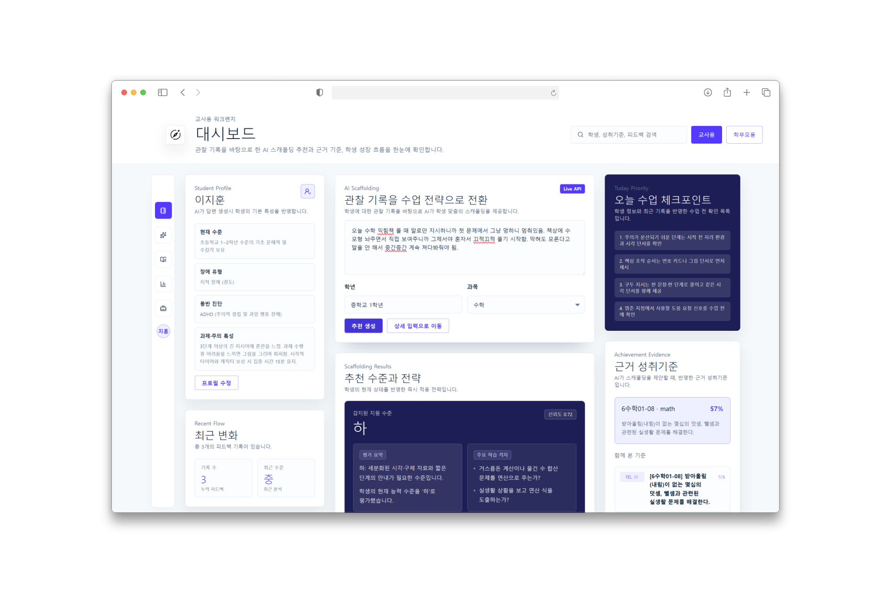
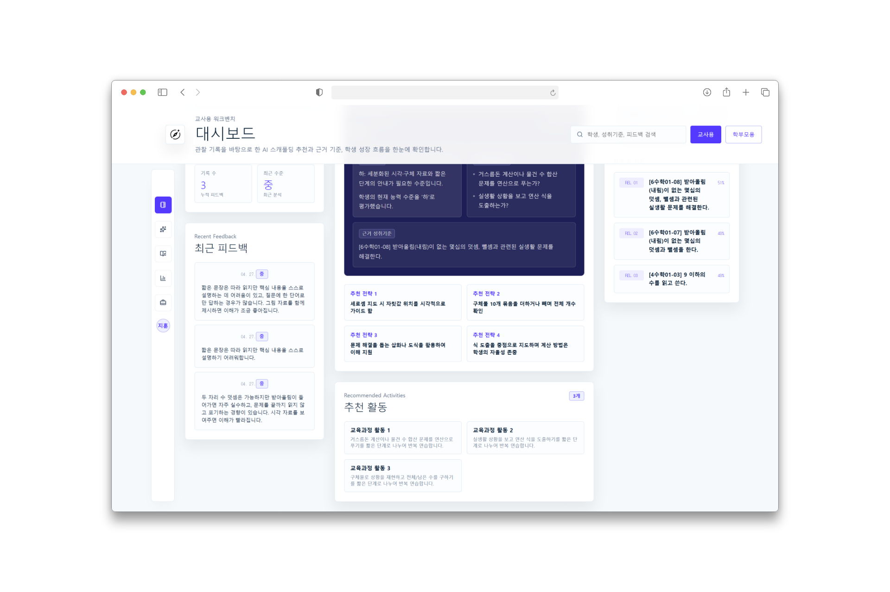

# 틔움(Tium)
**RAG 아키텍처와 공공데이터를 활용한 지능형 특수교육 스캐폴딩 플랫폼**

## 1. 사용 데이터 및 설명

| 데이터셋 명칭 | 활용 목적 및 내용 | 제공 기관 | 비고 | 라이선스 | 
| :--- | :--- | :--- | :--- | :--- |
| **교육부 특수교육 통계** | 연도별 특수교육대상자 수, 학교 배치 현황, 장애 유형 비율 등 현황 분석 자료 활용 | 교육부 | **공공데이터** | 공공누리 제1유형 |
| **나이스(NEIS) 교육정보** | 학사일정, 시간표, 급식 정보 등 학교 생활 기본 데이터 연동 | 교육부 | **공공데이터** | 공공누리 제0유형 |
| **2022 개정 특수교육 성취기준** | 학년별·과목별 성취 목표 및 교수·학습 가이드 데이터 활용 | 교육부 / NCIC | **공공문서** | 공공누리 제2유형 |
| **특수교육 성취기준 풀(Pool)** | 행동 단위(Task Analysis) 기반의 세부 교육 활동 및 지도 데이터 구축 | 국립특수교육원 | **공공문서** | 공공누리 제4유형|
| **커리어넷 직업정보 데이터** | 직업별 핵심 역량 및 진로 정보를 학생 성장 로드맵 설계에 활용 | 교육부 / 한국직업능력연구원 | **공공데이터** | 공공누리 제1유형 |

> **제4유형 데이터의 기술적 형태 변환 (대회 사무국 사전 승인 완료)**: '특수교육 성취기준 풀(Pool)' 자료는 공공누리 제4유형(변경 금지)에 해당하나, 원본의 교육적 맥락과 의미 훼손 없이 AI 시스템(RAG)이 판독할 수 있도록 형태만 변환(JSON 구조화 및 Chunking)하는 기술적 전처리는 본 대회 출품 목적에 한하여 가능함을 '대회 운영 사무국'을 통해 사전 확인 및 승인받았습니다. 단, 추후 본 시스템을 실제 비즈니스 모델로 상용화할 경우에는 데이터 제공 기관인 국립특수교육원과 정식 업무협약(MOU) 체결 및 추가 활용 협의를 진행할 계획입니다.

## 2. 배경 및 문제 제기

### 매년 늘어나는 특수교육대상자와 가중되는 현장의 부담

- 특수교육대상자는 매년 꾸준히 증가하여 2025년에는 총 120,735명으로 나타남
- 특히 일반학교(통합학급)에 배치되는 학생의 비율이 압도적으로 높아, 일반 및 특수 교사들의 실무적 부담이 급증하고 있음

<br>

### 너무나도 다양한 장애의 유형: "어떻게 가르칠 수 있을까요?"

- 특수교육대상자는 지적장애(49.2%), 자폐성장애(21.2%), 발달지체(12.3%) 등 매우 다양한 장애 특성을 지님
- 동일한 장애 유형이라 하더라도 학생마다 인지, 행동, 의사소통 방식이 달라 적합한 교육 방법 역시 다양하게 달라짐
- 교사와 학생 모두 새로운 학급 환경과 서로의 특성을 이해하고 적응하는 데 많은 시간과 노력이 필요하며, 맞춤형 교육을 운영하는 과정에서도 다양한 어려움이 발생함

## 3. 해결 방안 및 구현 방안

### 현장의 주요 문제점

- 학생마다 필요한 개입 수준과 지도 방식이 달라, 교사가 적절한 지원 범위를 판단하기 어려움
- 시각·청각·지적장애 등 다양한 장애 특성과 중복 장애를 고려한 맞춤형 지도 자료와 사례가 부족함
- 학교와 가정 간의 교육 정보 및 지도 방향 연계가 원활하지 않아 지속적인 지원에 어려움이 존재함

<br>

### 이론적 배경: Vygotsky의 ZPD 이론

비고츠키(Vygotsky)의 근접발달영역(ZPD, Zone of Proximal Development)은  
학습자가 혼자 해결할 수 있는 수준과 타인의 도움을 받아 해결할 수 있는 수준 사이의 영역을 의미함.

- 학생은 적절한 도움과 상호작용을 통해 더 높은 수준의 학습에 도달할 수 있음
- 교사, 보호자, 또래의 지원은 학습 과정에서 중요한 역할을 수행함
- 학습자의 현재 수준에 맞춘 단계적 지원(Scaffolding)이 효과적인 학습을 이끈다고 설명함

<br>

### 기술적 배경: RAG(Retrieval-Augmented Generation)

RAG는 생성형 AI가 답변을 생성하기 전에 외부 데이터를 먼저 검색(Retrieval)한 뒤,  
검색된 정보를 기반으로 답변을 생성(Generation)하는 구조를 의미함.

- 특수교육 성취기준, 성취기준 풀(Pool), 커리어넷 직업 정보 등 공신력 있는 데이터를 기반으로 학생의 현재 수준과 특성을 분석함
- 검색된 데이터를 바탕으로 학생 수준에 적합한 맞춤형 비계(Scaffolding)와 지도 방향을 제안할 수 있음
- 단순 생성형 AI보다 더 정확하고 신뢰도 높은 결과를 제공할 수 있으며, 최신 정보와 교육 도메인 데이터를 효과적으로 반영할 수 있음
- 생성형 AI의 대표적인 문제인 할루시네이션(Hallucination) 현상을 줄이는 데 효과적임

## 4. 시스템 아키텍처


- **Frontend:** Vue.js
- **Backend:** FastAPI (Python)
- **Database:** PostgreSQL
- **AI Module:** LLM + RAG
- **Infrastructure:** Docker, Oracle Cloud, Vercel

<br>

### 시스템 동작 흐름

1. 사용자가 Vue.js 기반 웹 서비스에서 정보를 입력
2. FastAPI 서버가 사용자 요청을 처리
3. RAG 모듈이 특수교육 성취기준, 성취기준 풀(Pool), 커리어넷 데이터 등을 검색
4. LLM이 검색 결과를 기반으로 맞춤형 지도 전략 및 응답 생성
5. 생성된 결과를 사용자 화면에 시각적으로 제공


## 5. 핵심 기능 1 - AI 맞춤형 스캐폴딩

학생의 수업 참여도, 이해 수준, 행동 특성 등을 교사가 기록하면,  
AI가 학생의 현재 수준을 분석하여 ZPD(근접발달영역) 기반의 맞춤형 스캐폴딩을 제안함.




- 학생 수준에 적합한 교육 활동 및 학습 과제 추천
- 교사의 개입 강도와 지도 방향 제안
- 특수교육 성취기준 및 성취기준 풀(Pool) 기반 학습 목표 매칭
- 학생 특성과 장애 유형을 고려한 맞춤형 지원 전략 제공

## 6. 핵심 기능 2 - 학생 성장 분석 및 진로 로드맵 설계

학생의 누적된 학습 기록과 스캐폴딩 데이터를 분석하여  
학생의 강점과 관심 분야를 발견하고, 이에 적합한 진로 방향과 성장 활동을 제안함.


- 학생의 학습 패턴과 행동 특성을 기반으로 강점 및 관심 영역 분석
- 강점과 연관된 직업 및 활동 분야 추천
- 학생 수준에 맞춘 단계별 역량 성장 방향 제시
- 커리어넷 데이터를 활용한 현실적인 진로 탐색 지원
- 장기적인 성장 과정을 시각적으로 확인할 수 있는 로드맵 제공

## 7. 그 외 기능

교사·학생·학부모 간의 연결을 강화하고,  
학생의 학교생활 적응과 가정 연계 교육을 지원하는 다양한 부가 기능 제공.


- **NEIS 연동**
  - 나이스(NEIS) API 기반으로 시간표, 준비물, 급식 메뉴 등의 학교 정보를 자동 연동
  - 학생이 일상적인 학교생활을 보다 안정적으로 준비하고 적응할 수 있도록 지원

- **가정 연계 알림장**
  - 학교에서 효과적이었던 지도 방식과 스캐폴딩 사례를 학부모와 공유
  - 가정에서도 유사한 방식의 연계 지도가 가능하도록 지원
  - 교사·학부모 간 지속적인 소통 및 협력 환경 제공

## 8. AI 활용 과정

### 1. 생성형 AI를 활용한 초기 자료 조사
- 프로젝트 초기 기획 단계에서 생성형 AI(Perplexity)를 활용하여 특수교육 관련 정책, 공공데이터, 활용 사례 등을 조사
- 특수교육 성취기준, 교육과정 성취기준 풀(Pool), 커리어넷 데이터 등 실제 서비스에 활용 가능한 데이터 종류와 구조를 탐색

#### 예시 프롬프트
```text
대한민국 특수교육 관련 공공데이터에는 어떤 것들이 있는가?

특수교육 성취기준 데이터와 연계 가능한 진로 데이터셋 사례를 알려줘.

RAG 기반 교육 서비스에 활용 가능한 국내 공공 교육 데이터 종류를 정리해줘.
````

<br>

### 2. AI를 활용한 데이터 전처리 및 구조화

* PDF 형태로 제공되는 특수교육 성취기준 및 교육과정 데이터를 AI 코드 생성 도구(Codex)를 활용하여 JSON 형태로 변환
* 데이터 구조를 통일하고 계층 구조를 정리하여 검색 및 AI 분석이 가능한 형태로 가공

#### 예시 프롬프트

```text
이 PDF 데이터를 과목, 영역, 성취기준 코드, 성취기준 내용 형태의 JSON 구조로 변환해줘.

불필요한 줄바꿈과 특수문자를 제거하고 계층 구조를 유지해서 JSON으로 정리해줘.

성취기준 데이터를 벡터 DB에 저장하기 좋은 형태로 전처리해줘.
```

<br>

### 3. AI 기반 개발 및 디버깅

* 백엔드(FastAPI) 개발 과정에서 AI(Codex)를 활용하여 API 로직 구현 및 기능 개발 진행
* 개발 후반부에는 병목현상 및 비효율 로직을 분석하고 디버깅하는 데 AI를 활용
* 비동기 처리 구조 및 데이터 흐름을 개선하여 응답 속도와 안정성을 최적화

#### 예시 프롬프트

```text
FastAPI에서 비동기 요청 처리 시 병목현상이 발생하는 원인을 분석해줘.

현재 RAG 검색 로직에서 응답 속도가 느린데 최적화할 수 있는 방법을 알려줘.

PostgreSQL 쿼리 속도가 느린 원인을 분석하고 개선 방향을 제안해줘.
```

<br>

### 4. 발표 자료 제작 과정에서의 AI 활용 예정

* 최종 발표 자료(PPT) 제작 과정에서도 생성형 AI를 활용하여 발표 흐름 구성, 문장 정리, 디자인 아이디어 도출 등에 활용 예정

#### 예시 프롬프트

```text
AI 기반 특수교육 서비스를 주제로 발표 흐름을 구성해줘.

교육 프로젝트 발표용 PPT 목차와 핵심 메시지를 정리해줘.

특수교육 AI 서비스 발표에 어울리는 PPT 디자인 방향을 추천해줘.
```

## 9. 기대 효과

### 교사 측면
- 학생 분석, 자료 탐색, 지도 전략 설계 등에 소요되는 시간과 부담 경감
- 반복적인 행정 및 연구 업무를 줄여 학생과의 상호작용 및 정서적 지원에 집중 가능
- 다양한 장애 특성에 대한 맞춤형 지도 방향 참고 가능

<br>

### 학부모 측면
- 학생의 학교생활과 성장 과정을 보다 직관적으로 확인 가능
- 학교와 가정 간의 교육 방향을 연계하여 일관된 지원 환경 조성
- 자녀의 발달 과정에 대한 불안감 완화 및 신뢰 형성 기대

<br>

### 사회·교육 측면
- 흩어져 있는 특수교육 공공데이터의 활용 가치 증대
- 데이터 기반의 체계적인 특수교육 지원 환경 구축 가능
- 교사·학생·학부모를 연결하는 지속 가능한 특수교육 생태계 형성 기대